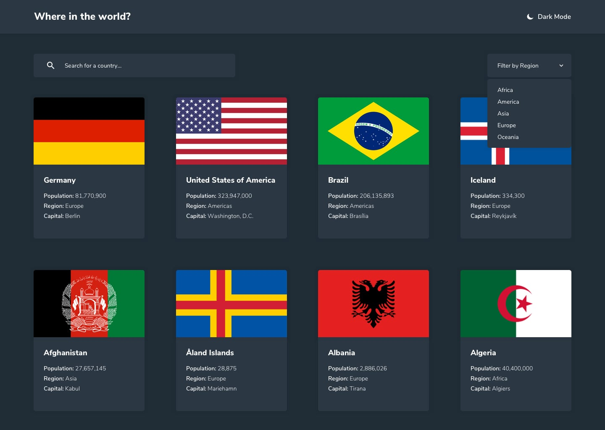

# Frontend Mentor - REST Countries API with color theme switcher solution

This is a solution to the [REST Countries API with color theme switcher challenge on Frontend Mentor](https://www.frontendmentor.io/challenges/rest-countries-api-with-color-theme-switcher-5cacc469fec04111f7b848ca). Frontend Mentor challenges help you improve your coding skills by building realistic projects.

## Table of contents

- [Overview](#overview)
  - [The challenge](#the-challenge)
  - [Screenshot](#screenshot)
- [My process](#my-process)
  - [Built with](#built-with)
  - [Features](#features)
  - [What I learned](#what-i-learned)
  - [Continued development](#continued-development)
  - [AI Collaboration](#ai-collaboration)
- [Author](#author)

## Overview

### The challenge

Users can:

- See all 250 countries from the supplied data on the homepage
- Search for a country by name, case-insensitively and as they type
- Filter countries by region
- Combine search and region filtering at the same time
- Click on a country to see more detailed information on a separate page
- Click through to a country's border countries from the detail page
- Toggle the color scheme between light and dark mode, with the choice remembered on their next visit

### Screenshot




*(The images above are the original design references in `src/design/`. Swap in a screenshot of the live build once it's deployed.)*

## My process

### Built with

- [React](https://react.dev/) 19
- [React Router](https://reactrouter.com/) - client-side routing between the homepage and country detail pages
- [Tailwind CSS](https://tailwindcss.com/) - utility-first styling, with the challenge's color palette wired up as custom theme tokens (`darkBg`, `darkElements`, `lightText`, `lightInput`, `lightBg`)
- [Vite](https://vite.dev/) - dev server and build tooling
- Mobile-first, responsive layout (1 → 2 → 3 → 4 columns depending on viewport)
- Semantic HTML and keyboard-accessible controls throughout

### Features

- **Homepage** - all countries render dynamically from the supplied `data.json`; nothing is hardcoded.
- **Search** - a live text filter matched against each country's name, case-insensitive and partial-match.
- **Region filter** - a custom, keyboard- and click-outside-aware dropdown built from the regions actually present in the data (rather than a hardcoded list), with a reset option to show every region again.
- **Country details** - native name, population, region, subregion, capital, top-level domain, currencies and languages, with graceful `N/A` fallbacks for any field a country is missing.
- **Border countries** - resolved via each country's `alpha3Code`, not its display name, and clickable through to that country's own detail page.
- **Light/dark theme** - toggles a `dark` class on the document root, persists the choice to `localStorage`, and applies it *before* first paint (via a small inline script in `index.html`) so there's no flash of the wrong theme on reload.
- **Error handling** - an invalid `/country/:code` route shows a "Country not found" state instead of crashing, and missing country data never breaks the layout.

### What I learned

Reproducing a static JPG design in a responsive, data-driven app means deciding early which values are "real" design tokens versus incidental JPG artifacts. Pulling the color palette straight from `style-guide.md` into Tailwind's theme config (rather than eyeballing hex values from the screenshots) kept light/dark mode consistent across every component instead of drifting component-by-component.

```js
// tailwind.config.js
theme: {
  extend: {
    colors: {
      darkBg: 'hsl(207, 26%, 17%)',
      darkElements: 'hsl(209, 23%, 22%)',
      lightText: 'hsl(200, 15%, 8%)',
      lightInput: 'hsl(0, 0%, 50%)',
      lightBg: 'hsl(0, 0%, 99%)',
    },
  },
}
```

The other useful lesson was around theme persistence: setting `localStorage`/`prefers-color-scheme` from a React `useEffect` alone still lets the page flash light mode for a frame before hydration. Applying the class synchronously in a tiny inline `<script>` in `index.html`, ahead of the React bundle, removes that flash entirely.

### Continued development

- Code-split the country data / routes so the initial JS bundle is smaller (currently ~136 KB gzipped, mostly the 250-country dataset).
- Add automated tests around the search/filter utilities and the theme toggle.
- Consider adding a loading/skeleton state if the data source ever moves from a static import to a real network request.

### AI Collaboration

This project was completed with [Claude](https://claude.com) (Anthropic).

- **What I used it for:** inspecting the starter project, README, style guide, data file, and design screenshots; building out the full component/page structure (search, region filter, country cards, detail page, border-country navigation, light/dark theming); and fixing follow-up issues (a flash-of-wrong-theme bug on page load, and verifying the color palette matched `style-guide.md` exactly).
- **How I worked with it:** gave it the starter repo and a detailed spec, then reviewed the generated app against the provided screenshots and asked for fixes when something didn't match.
- **What worked well:** it read the actual `data.json` structure instead of assuming the live REST Countries API's shape, which avoided a class of bugs (for example, `nativeName` is a plain string here, not an object of language codes). It also caught and fixed a real issue where `<html>`/`<body>` themselves had no background color set (only the React-rendered content did), which caused a flash of light mode outside the app root before the theme took effect.

## Author

- Frontend Mentor - [@GentleWhiz](https://www.frontendmentor.io/profile/GentleWhiz)
